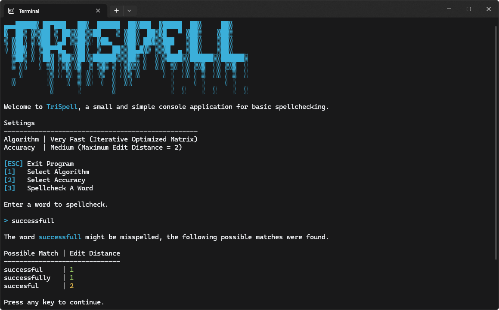

# TriSpell

TriSpell is a small and simple console application that provides basic spellchecking.



## Features

As a fun little side project of mine, TriSpell was intended to explore how basic spellchecking could
be implemented using the so called
[Levenshtein distance](https://en.wikipedia.org/wiki/Levenshtein_distance) metric. Named after
soviet mathematician Vladimir Levenshtein who originally defined it in 1965, this metric computes
the similarity of two sequences of characters (more commonly referred to as
"strings" in most programming languages of today):

- A **source** string, which can be thought of as a word entered by the user.
- A **target** string representing a word that the user may have intended to type (but misspelled).

The metric itself, sometimes also just called "edit distance", is defined as the minimum number of
of single-character edits (i. e. insertions, deletions, or substitutions) required to transform the
source string into the into the target string. It may be implemented using a variety of different
algorithms, and as such TriSpell offers three of the most common implementations for the user to
choose from:

| Algorithm                   | Efficiency  | Description                                                                                                                                                                                                                                                                                                                                   |
| --------------------------- | ----------- | --------------------------------------------------------------------------------------------------------------------------------------------------------------------------------------------------------------------------------------------------------------------------------------------------------------------------------------------- | 
| Recursive                   | --          | A naive, recursive implementation that more or less directly corresponds to the original mathematical definition by Vladimir Levenshtein. It shows a very poor efficiency (especially on larger inputs), since a lot of the prefixes of the source and target strings are unnecessarily compared more than once (unless memoization is used). |
| Iterative Full Matrix       | +           | This slightly more advanced implementation employs techniques of dynamic programming. It uses a two-dimensional matrix to cache the edit distances between all prefixes of the source and target strings, thus avoiding unnecessary calculations.                                                                                             |
| Iterative Optimized Matrix  | ++          | Even more advanced implementation that makes use of an important optimization: For calculating the edit distance at a certain position, only the previous and current row of edit distances are ever needed. This usually reduces the memory footprint and runtime even further in comparison to the full matrix algorithm.                   |

For more details on the individual algorithms see
[this article](https://en.wikipedia.org/wiki/Levenshtein_distance) from Wikipedia, which also
contains useful pseudocode I used as reference for the implementation.

In addition to the algorithms, the user may choose from three different accuracy levels. While the
specific implementation (i. e. the maximum allowed edit distance per level) may be subject to change
in the future, it is currently defined as follows:

| Accuracy Level  | Maximum Edit Distance  |
| --------------- | ---------------------- |
|  Low            | 3                      |
|  Medium         | 2                      |
|  High           | 1                      |

Please feel free to experiment with and adjust this to your own preference ;).

## Dependencies and Usage

TriSpell was originally developed using `.NET 8` and `C# 12`. I plan on upgrading the project to
future versions to take advantage of new language features if feasible to do so. For the time being,
simply follow these steps to check out TriSpell:

0. Make sure you have `.NET 8` or newer installed on your machine.

1. Clone the repository (or download the source code) to a directory of your choice.
   ```shell
   git clone https://github.com/Piwimau/TriSpell.git ./TriSpell
   cd ./TriSpell
   ```

2. Build and run the application.
   ```shell
   dotnet build
   dotnet run
   ```

Alternatively, if you have Visual Studio installed on your machine, simply open the provided
[solution file](TriSpell.sln) and proceed from there.

## Acknowledgements

I was originally inspired to create TriSpell after watching
[this video](https://www.youtube.com/watch?v=Cu7Tl7FGigQ) by
[Creel](https://www.youtube.com/@WhatsACreel), which features some nice animations and
explanations of the algorithms. I can highly recommend the video and the channel in general for
anyone interested in low-level programming concepts.

TriSpell uses a dictionary of english words which is licensed under
[The Unlicense](https://unlicense.org/) and can be found
[here](https://github.com/dwyl/english-words).

The three edit distance algorithms implemented are based on the information from
[this](https://en.wikipedia.org/wiki/Levenshtein_distance) and
[this](https://en.wikipedia.org/wiki/Wagner%E2%80%93Fischer_algorithm) Wikipedia article.

## License

TriSpell is licensed under the [MIT License](LICENSE). Feel free to experiment with the code,
adapt it to your own preferences, and share it with others.